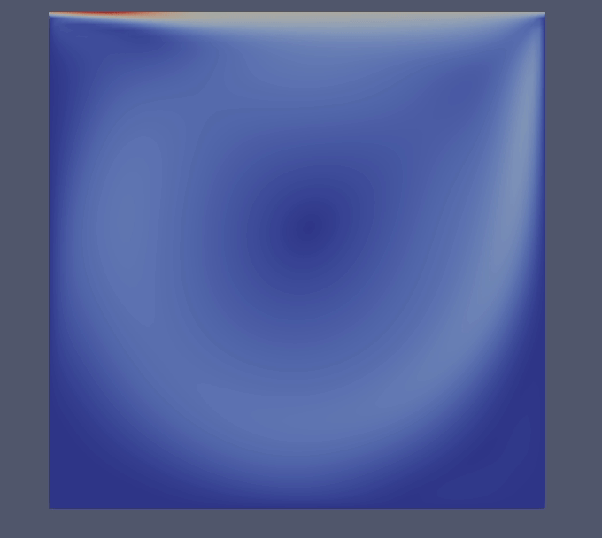
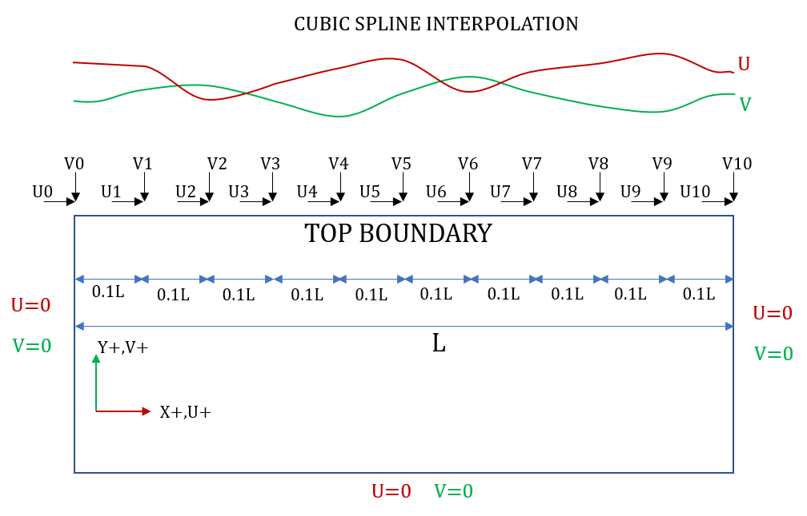

# 2D NAVIER STOKES
> Bidimensional Solver of Navier Stokes equations with Finite Differences - FORTRAN

2D Navier Stokes finite differences solver with CSC storage and solvers for matrices.

With Fortran - GNU-Fortran compiler (and Matlab originals).

Most relevant things in this solver are the Compressed Sparse Column (CSC) tools developed.

<!---->
<p align="center">
  
  
</p>

## Installation

OS X & GNU-Linux:

```sh
git clone https://github.com/sacastiblancob/cavity_NS.git
```

```sh
make clean; make
```

## Usage example

To run the solver you should have a Fotran compiler (if possible use GNU-Fortran!!), change in the Makefile the lines related with the compiler and user specific configuration (the actual version works perfectly with Gfortran).

Once the Makefile is modified (if you need to), you should compile it by typing the make clean and make commands. The .out executable file will be located in the ./bin/ folder.

Modify the configuration in the ./nsconf.nml file, if you want to change input variables, modifiable ones are explained within this file.

Once you have configured your scenario and compile the solver, you can run it by the following command:

```sh
./bin/ns_df.out
```

Wait to reach the Final Time and all the information you need to know will be printed in the terminal, it will show you values such as the tolerance and number of iterations used by the SOR solver in the pressure step, the number of iterations of Conjugate Gradient Solver in diffusion step, Reynolds number, etc.

The results will be storaged in the ./res/ forder, in the .dat files. You can load them into Paraview by using the "TecPlot Reader" option.

Printed Variables: Coordinates, Velocity in X direction (U), Velocity in Y direction (V), Pressure (P) and magnitude of velocity (U_MAG)

To change top boundary condition input, you should enable the logical ISBOUND in the configuration file "nsconf.nml", and introuduce the path to your boundary condition file in the configuration variable BOUNDFILE, example:

```sh
BOUNDFILE = './liquid/liquid_boundary.txt
```

You should keep the format of the examples, you can use the file "./liquid/sample_boundary.ods" to create your own top boundary condition over time: two first rows are reserved for variable names and units, the first column is reserved for time (in seconds) and the next 22 columns for the values of velocity in X (U) and velocity in Y (V). The location of these velocities are shown in the next image.

<p align="center">
  
</p>

The values of the given boundary condition will be interpolated into the grid through cubic spline interpolation method (to ensure smooth changes in the space), and it will have linear interpolation in time.

You can also give a text file with initial condition, enable the logical ISSTART in the "nsconf.nml" file, and introduce the path to your initial condition file in the configuration variable STARTFILE:

```sh
STARTFILE = './liquid/hot_start.dat
```

This initial condition file should have the same format as the result files stored in "./res/" folder, after run your simulation; so the best way to create an initial condition is by running once the simulation with default initial condition.

The number of nodes in the variables NX and NY in the "nsconf.nml" file must be the same as the number of nodes in your initial condition file.

Default initial condition is U=0 and V=0 in whole domain, and U=1.0 in the top boundary, and it will prevail the same all along the simulation unless otherwise stated by the user in the configuration.

Boundary and initial condition options are now Fully Functional, and these were tested with a wide range of combinations.

## Brief Physical and Numerical Theory

Navier-Stokes Equations:


The strategy to solve them is Fractional Steps:

1. Solve the advection step with second order upwind scheme in space and forward Euler in time (which means explicit).


2. Solve the pressure by the introduction of Euler discretization in time and the continuity condition, which leads to the Poisson's equation with Null Neumann Boundary Conditions:


The discretization is performed through centered second order derivatives for both the second derivatives of the pressure and first derivatives of Up and Vp.

This configuration leads to a singular system of equation, which has solution only if a certain compatibility condition is met. To ensure it, the regularization method is used (./papers/posrikidiz2001).

Since the zeroth singular eigenvector of the adjoint matrix of the system is needed for the regularization methodology, this is computed previously with the Inverse Power Method and Conjugate Gradient method under a certain initial guess (to ensure convergence always, since the matrix is not fully symmetric, but almost).

Thereafter the system of equations is solved with Succesive Over-Relaxation method (the most computationally expensive step, tipically arround 250 iterations), once the pressure is solved, the result of this step (Upp, Vpp) is computed through:


The derivatives of the pressure are computed with second order centered scheme. Upp and Vpp already fit continuity condition.

3. Solve the diffusion step with second order centered schemes for second derivatives and backward Euler in time (which means implicit).


The system of equations is solved with Conjugate Gradient Method (typically arround 15 iterations per U and per V). 

## Folder Contents

./bin/ --> Executable file

./liquid/ --> Boundary and initial condition files (Fully functional)

./matlab/ --> Matlab Files (main = Solver_PF.m)

./mod/ --> Fortran modules

./obj/ --> Fortran objects

./res/ --> Solver results(.dat files)

./src/ --> Fotran source codes

./nsconf.nml --> Configuration file (change input variables here)

./Makefile --> Make compiler file

./README.md --> You are standing here

## Meta
Sergio A. Castiblanco-Ballesteros

Bogota - Colombia

Mail 1: sacastiblancob@unal.edu.co

Mail 2: sergio.castiblanco@javeriana.edu.co

> Free Distribution and Open Source (As it should be!!)


